# 第 1 章：静态分析基础技术

## Lab 1-1

这个实验使用 Lab01-01.exe 和 Lab01-01.dll 文件，使用本章描述的工具和技术来获取关于这些文件的信息。

### **1、将文件上传至** [**http://www.VirusTotal.com/**](http://www.VirusTotal.com/) **进行分析并查看报告。文件匹配到了已有的反病毒软件特征吗？**

答案：匹配到了。

检测报告：

*  [https://www.virustotal.com/gui/file/58898bd42c5bd3bf9b1389f0eee5b39cd59180e8370eb9ea838a0b327bd6fe47/detection](https://www.virustotal.com/gui/file/58898bd42c5bd3bf9b1389f0eee5b39cd59180e8370eb9ea838a0b327bd6fe47/detection)

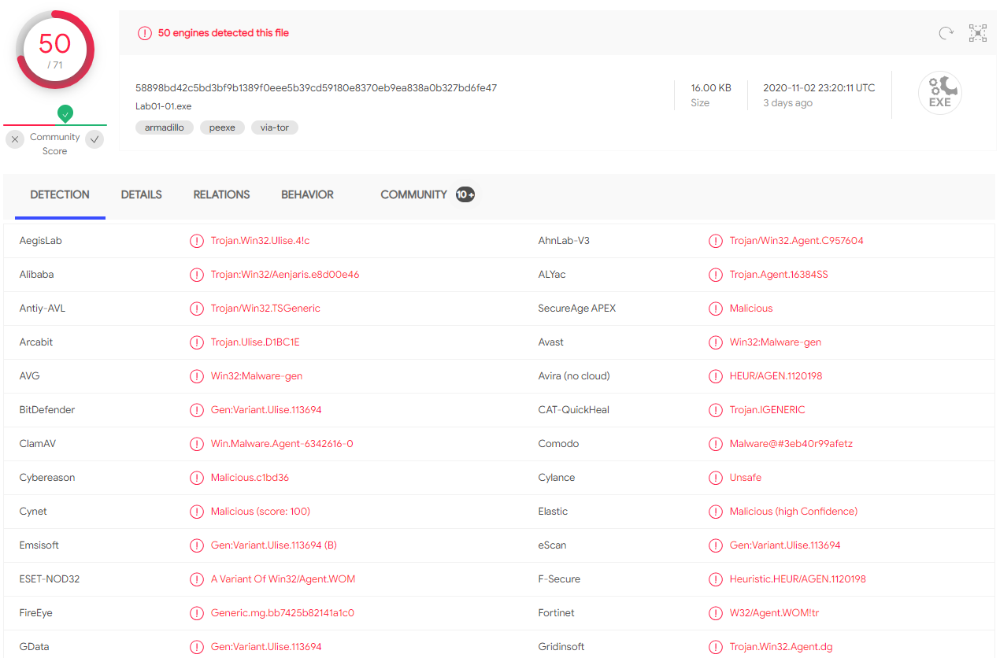

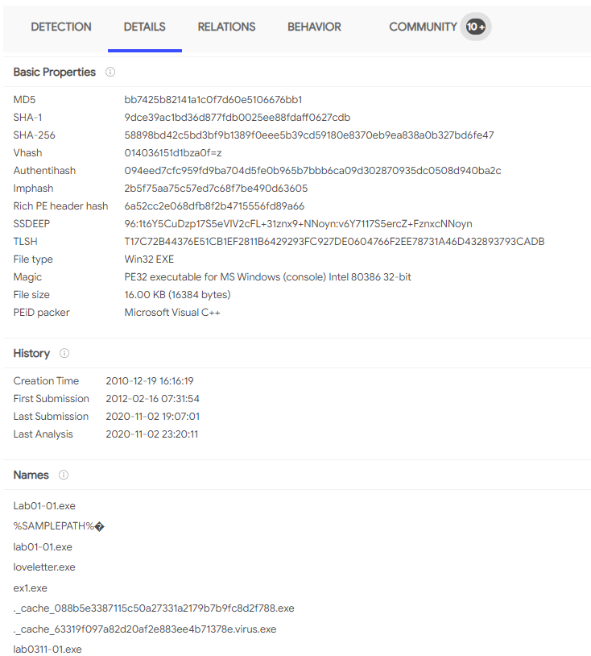

### **2、这些文件是什么时候编译的？**

答案：2010 年 12 月 20 日。与书中答案不同，我用 PEView 打开会报错，并且看不到时间戳信息，和文末的参考链接中所说的一致。需要用 Dependency Walker 打开才能看到。

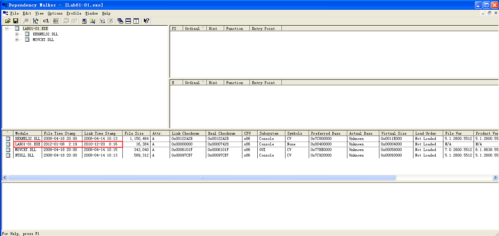

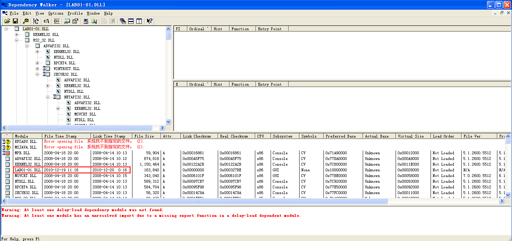

### **3、这两个文件中是否存在迹象说明它们是否被加壳或混淆了？如果是，这些迹象在哪里？**

答案：两个文件都没有加壳。都是用的 Micro Visual C++ 6.0 编译和链接的。使用 PEiD 可以查看该信息。

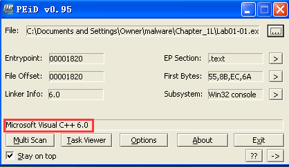

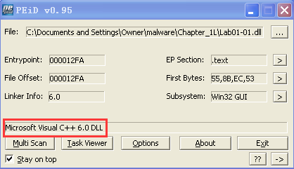

### **4、是否有导入函数显示出了这个恶意代码是做什么的？如果是，是哪些导入函数？**

答案：用 Dependency Walker 可以看到导入函数。

Lab01-01.exe 中，重点是 kernel32.dll 中同文件操作相关的导入函数。这意味着该程序可能会对系统中的文件进行搜索、调用和修改操作。

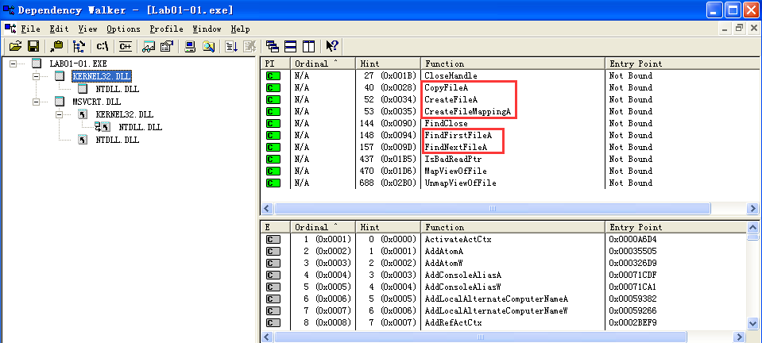

Lab01-01.dll 中，重点是 CreateProcessA 和 Sleep 导入函数，这两个函数经常在后门程序中使用。WS2\_32.dll 则提供了联网功能。

### **5、是否有任何其他文件或基于主机的迹象，让你可以在受感染系统上查找？**

使用 **strings -n 8 -nobanner Lab01-01.exe** 指令查看 Lab01-01.exe 中的字符串。除了已知的文件操作相关的字符串，我们还看到了 kerne132.dll，可能是恶意程序试图冒充 kernel32.dll，这里用数字 1 冒充字母 l。

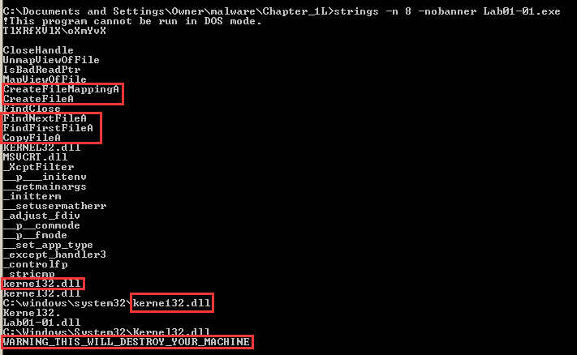

使用 **strings -n 4 -nobanner Lab01-01.dll** 指令查看 Lab01-01.dll ****中的字符串。除了已知的 CreateProcessA 和 Sleep，我们还注意到 exec 和 sleep。exec 可能用于通过网络给后门程序传送命令 ，再利用 CreateProcess 函数运行某个程序 。sleep 可能用于让后门程序进入休眠模式。

### **6、是否有基于网络的迹象，可以用来发现受感染机器上的这个恶意代码？**

答案：上图解析出的字符串中，包含了一个 IP 地址：127.26.152.13。结合其调用的 WS2\_32.dll，猜测该程序可能联网通信。尽管 127 开头的 IP 为本地地址，在此处表明是用于教学目的，现实中很可能指向一个具体的外网 IP。

### **7、你猜这些文件的目的是什么？**

.dll 文件可能是一个后门，而 exe 文件则用于安装和运行该后门。

### 参考链接

* 恶意代码分析实战 Lab 1-1 习题笔记\_isinstance的博客-CSDN博客 
  * [https://blog.csdn.net/isinstance/article/details/77531267](https://blog.csdn.net/isinstance/article/details/77531267)
* 恶意代码分析实战 — Lab 01-01 – Atom Kid 
  * [http://www.atomsec.org/安全/恶意代码分析实战-lab01-01/](http://www.atomsec.org/安全/恶意代码分析实战-lab01-01/)

## Lab 1-2

分析 Lab01-02.exe 文件。

### **1、将 Lab01-02 .exe 文件上传至** [**http://www.VirusTotal.com/**](http://www.VirusTotal.com/) **进行分析并查看报告。文件匹配到了已有的反病毒软件特征吗？**

答案：匹配到了。

检测报告：

*  [https://www.virustotal.com/gui/file/c876a332d7dd8da331cb8eee7ab7bf32752834d4b2b54eaa362674a2a48f64a6/detection](https://www.virustotal.com/gui/file/c876a332d7dd8da331cb8eee7ab7bf32752834d4b2b54eaa362674a2a48f64a6/detection)

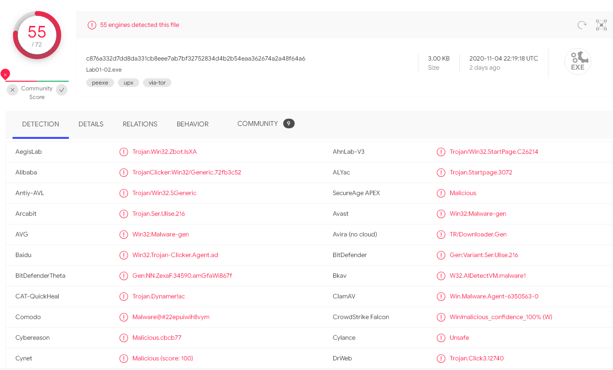

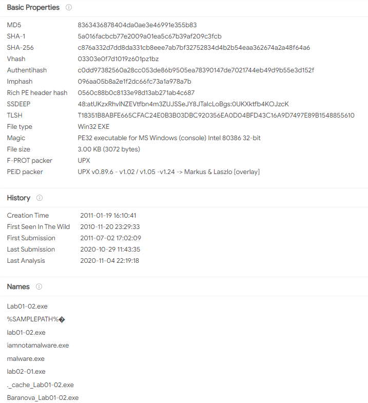

### **2、是否有这个文件被加壳或混淆的任何迹象？如果是这样，这些迹象是什么？如果该文件被加壳， 请进行脱壳，如果可能的话。**

答案：用 PEiD 打开，显示 “Nothing found \*”，表明被加壳了。

在 PEiD 的 Options 里选择 Deep Scan，发现是 UPX 加的壳。

事实上，用 PEview 查看节区，能发现 UPX字段，也能推出是 UPX 壳。

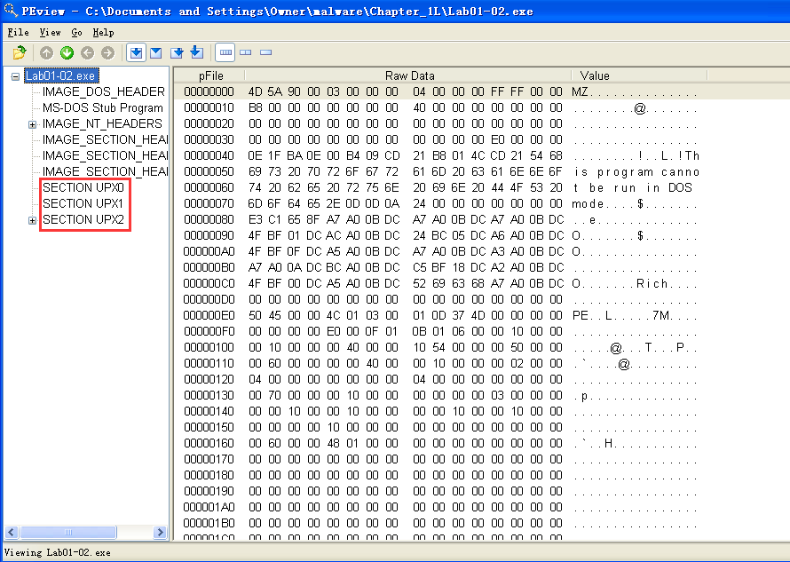

使用 **upx Lab01-02-decrypt.exe -d Lab01-02.exe** 命令对其脱壳。

用 PEiD 查看脱壳后的 Lab01-02-decrypt.exe，显示为 VC 6.0 编译。

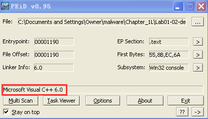

### **3、有没有任何导入函数能够暗示出这个程序的功能？如果是，是哪些导入函数，它们会告诉你什么？**

答案：使用 Dependency Walker 查看导入函数。

wininet.dll 中的 InternetOpen 和 InternetOpenUrl 函数，表明会进行联网操作。

advapi32.dll 中的 CreateService 函数，表明会创建服务。

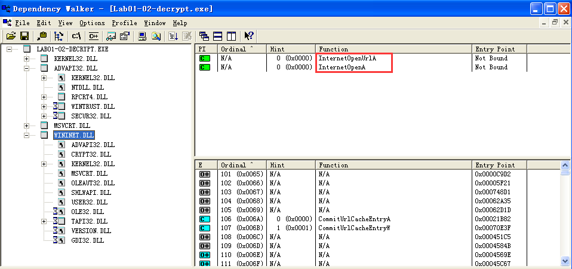

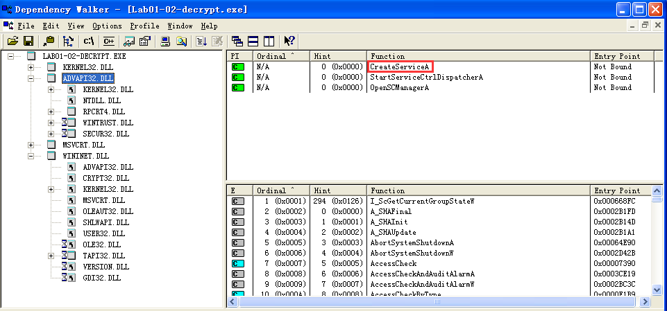

### **4、哪些基于主机或基于网络的迹象可以被用来确定被这个恶意代码所感染的机器？**

答案：使用 **strings Lab01-02-decrypt.exe** 命令查看字符串。可以看到 CreateMutex、CreateThread、CreateService、InternetOpenUrl、InternetOpen、**MalService** 等可疑函数。还有网址 **http://www.malwareanalysisbook.com**，和浏览器名 Internet Explorer 8.0。

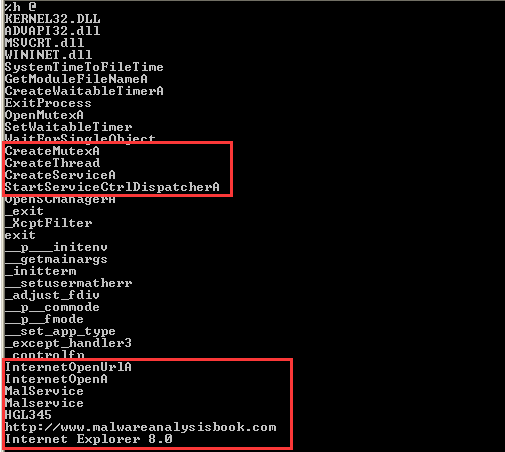

### 参考链接

* 恶意代码分析实战 — Lab 01-02 – Atom Kid 
  * [http://www.atomsec.org/安全/恶意代码分析实战-lab-01-02/](http://www.atomsec.org/安全/恶意代码分析实战-lab-01-02/)

## Lab 1-3

分析 Lab01-03.exe 文件。

### **1、将 Lab01-03.exe 文件上传至** [**http://www.VirusTotal.com/**](http://www.VirusTotal.com/) **进行分析并查看报告。文件匹配到了已有的反病毒软件特征吗？**

答案：匹配到了。

检测报告：

*  [https://www.virustotal.com/gui/file/7983a582939924c70e3da2da80fd3352ebc90de7b8c4c427d484ff4f050f0aec/detection](https://www.virustotal.com/gui/file/7983a582939924c70e3da2da80fd3352ebc90de7b8c4c427d484ff4f050f0aec/detection)

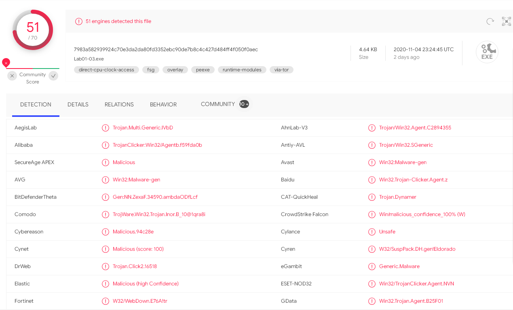

### **2、是否有这个文件被加壳或混淆的任何迹象？如果是这样，这些迹象是什么？如果该文件被加壳，请进行脱壳，如果可能的话。**

答案：PEiD 显示是 FGS 加的壳。以后再对其脱壳。

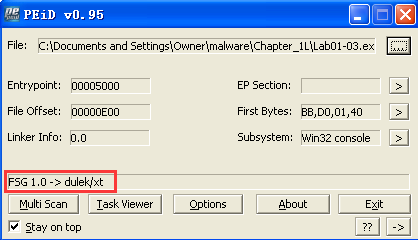

### **3、有没有任何导入函数能够暗示出这个程序的功能？如果是，是哪些导入函数，它们会告诉你什 么？**

答案：未脱壳前，只能在 kernel32.dll 中看到 LoadLibrary 和 GetProcAddress 导入函数。更多信息，需进一步脱壳才能得知。

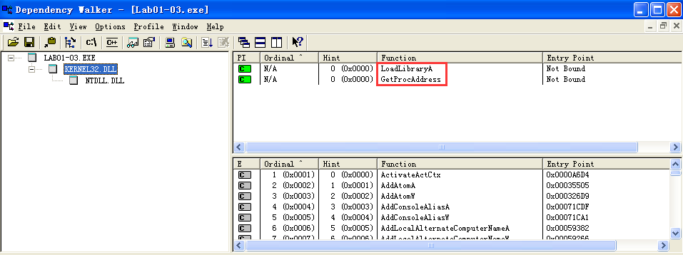

### **4、有哪些基于主机或基于网络的迹象，可以被用来确定被这个恶意代码所感染的机器？**

答案：更多信息，需进一步脱壳才能得知。

## Lab 1-4

分析 Lab01-04.exe 文件。

### **1、将 Lab01-04.exe 文件上传至** [**http://www.VirusTotal.com/**](http://www.VirusTotal.com/) **进行分析并查看报告。 文件匹配到了已有的反病毒软件特征吗？**

答案：匹配到了。可能为下载器。

检测报告：

*  [https://www.virustotal.com/gui/file/0fa1498340fca6c562cfa389ad3e93395f44c72fd128d7ba08579a69aaf3b126/details](https://www.virustotal.com/gui/file/0fa1498340fca6c562cfa389ad3e93395f44c72fd128d7ba08579a69aaf3b126/details)

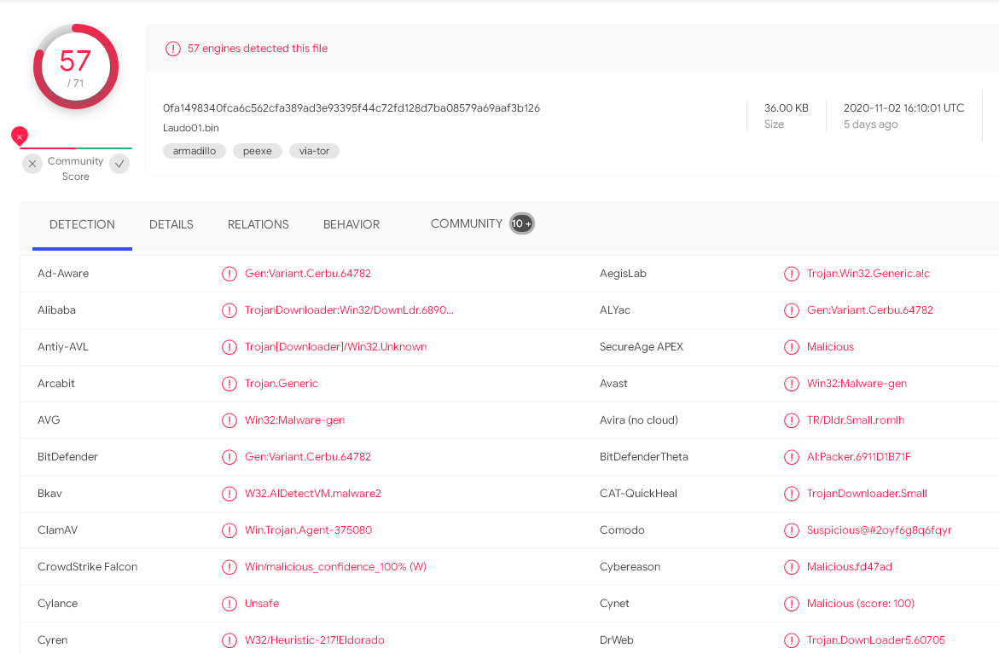

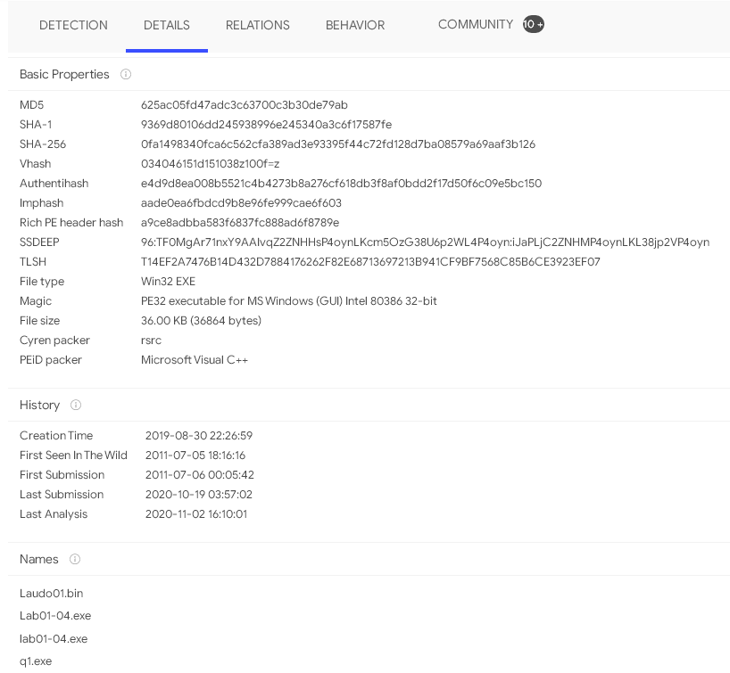

### **2、是否有这个文件被加壳或混淆的任何迹象？如果是这样，这些迹象是什么？如果该文件被加壳，请进行脱壳，如果可能的话。**

答案：没有加壳。使用 VC 6.0 编译链接。

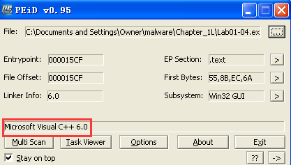

### **3、这个文件是什么时候被编译的？**

答案：2019 年 8 月 31 日（创建时间：2011 年 7 月 5 日）。同其他时间信息相比，该编译时间明显是伪造的。

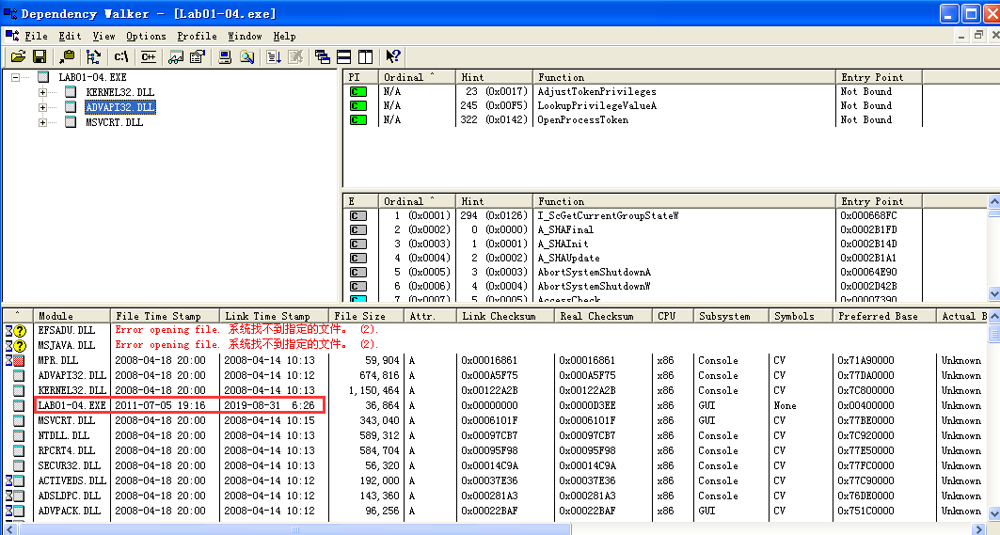

### **4、有没有任何导入函数能够暗示出这个程序的功能？如果是，是哪些导入函数，它们会告诉你什么？**

答案：

* kernel32.dll 的导入函数可能从资源节中装载数据（FindResource、LoadLibrary、LoadResource、SizeofResource），并写文件到磁盘中（CreateFile、WriteFile），并执行磁盘上的文件（WinExec），该文件甚至可能写到了系统目录（GetWindowsDirectory）。
* advapi32.dll 可能涉及到修改程序的权限（AdjustTokenPrivileges、LoopupPrivilegeValue、OpenProcessToken）。

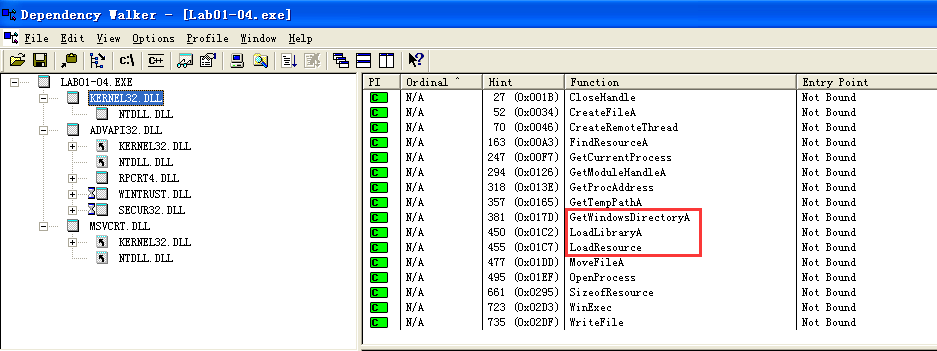

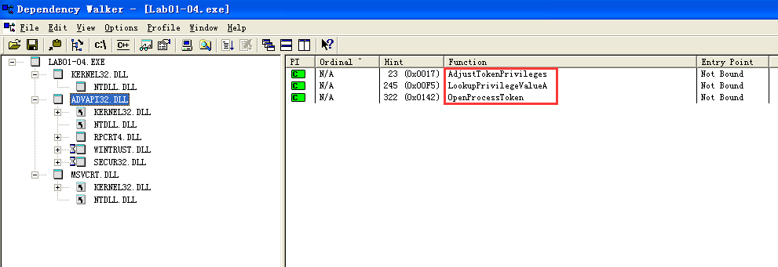

### **5、有哪些基于主机或基于网络的迹象，可以被用来确定被这个恶意代码所感染的机器？**

答案：解析程序中的字符串。

* \system32\wupdmgrd.exe （Windows 升级管理器）表明可能是在该路径下创建或修改文件。
* www.malwareanalysisbook.com/updater.exe 很可能是要下载的恶意代码的存储位置，或者是伪装成这个文件。URLDownloadToFile 则间接印证了下载器的功能。

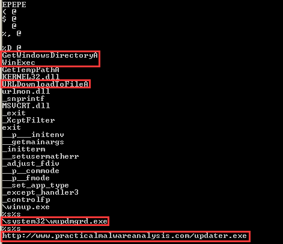

### **6、这个文件在资源段中包含一个资源。使用 Resource Hacker 工具来检查资源，然后抽取资源。从资源中你能发现什么吗？**

答案：可以看到资源段中还有一个可执行文件（101:1033）。

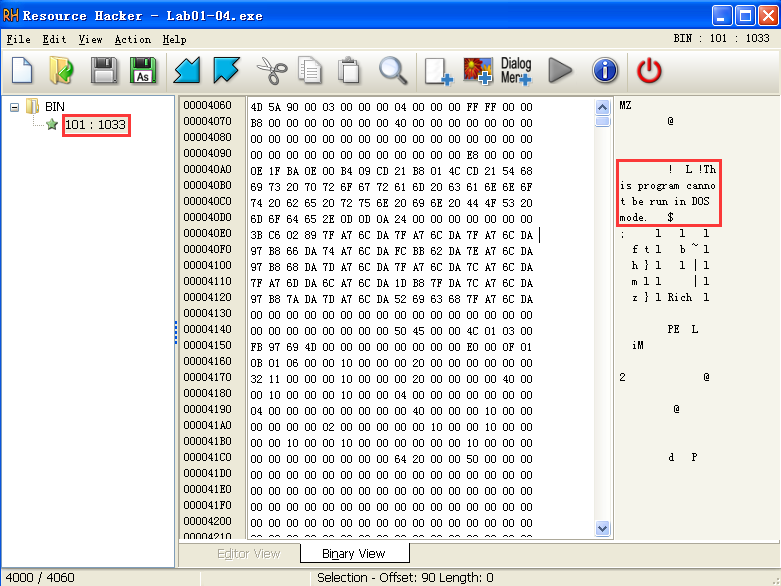

右键 101:1033，选择 Save Resource to a BIN file，命名为 Lab01-04-bin.exe。用 PEiD 查看加壳情况，很好，没有加壳，用的是 VC 6.0。

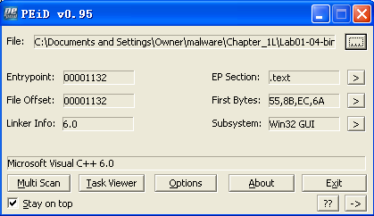

从 Lab01-04-bin.exe 中解析出的字符串在前文已经基本提过，功能是从远程主机中下载恶意代码。

VirusTotal 的检测报告显示该代码是恶意的，是一个下载器。

*  [https://www.virustotal.com/gui/file/819b2db1876d85846811799664d512b2f1af13e329f5debe60926c3b03424745/details](https://www.virustotal.com/gui/file/819b2db1876d85846811799664d512b2f1af13e329f5debe60926c3b03424745/details)

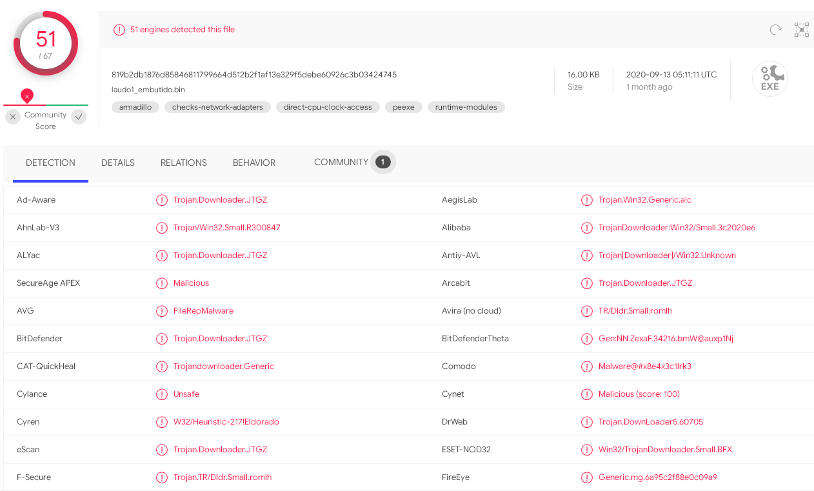

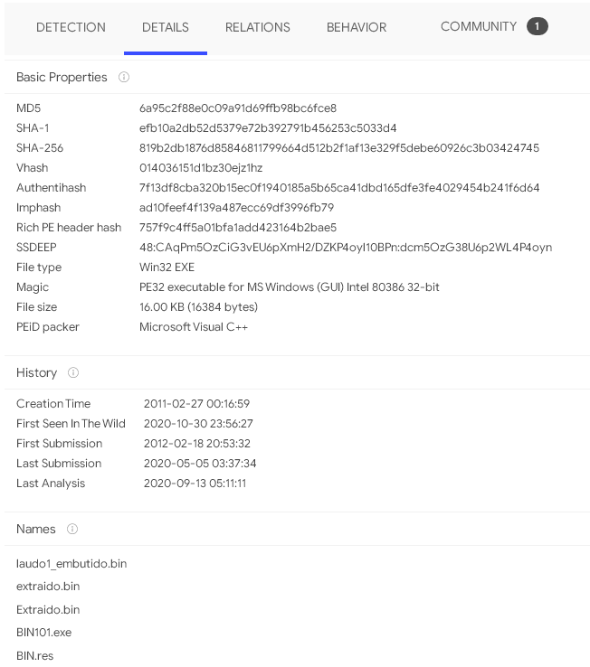

## 参考链接

* 恶意代码分析实战笔记\(一\) \| damaoooo的blog 
  * [https://damaoooo.github.io/2019/12/01/实验三/](https://damaoooo.github.io/2019/12/01/实验三/)

