# 第 3 章：动态分析基础技术

## Lab 3-1

使用动态分析基础技术来分析在 Lab03-01.exe 文件中发现的恶意代码。

### **1、找出这个恶意代码的导入函数与字符串列表？**

答案：先简单静态分析一下。用PEncrypt 加了壳。估计能得到的信息很少。

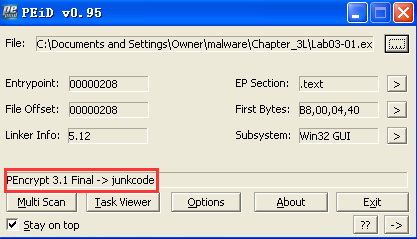

果然，导入函数也很少，只有 kernal32.dll 中的 ExitProcess。

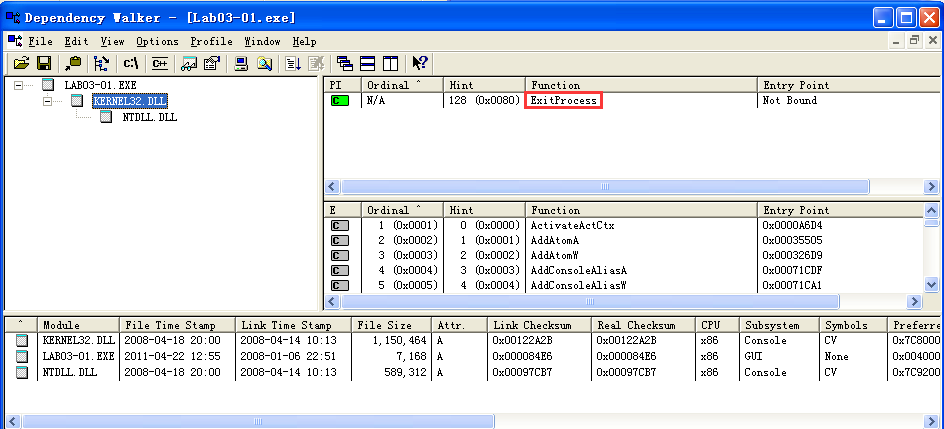

虽然加了壳，但是解析出的字符串又包含了程序名（vmx32to64.exe）、恶意网址（www.practicalmalwareanalysis.com）和文件路径（SOFTWARE\...），尤其是注册表信息。

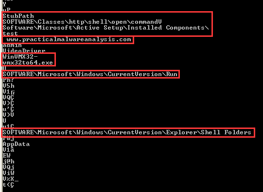

进行动态分析。做好如下配置：

* **拍摄 VMWare 快照（重要！）**
* ApateDNS：
  * DNS Reply IP 设置为 127.0.0.1
* Process Monitor：添加三个过滤
  * Process Name &gt; is &gt; Lab03-01.exe
  * Operation &gt; is &gt; WriteFile
  * Operation &gt; is &gt; RegSetValue
* 打开 Process Explorer
* 打开 netcat（nc 不支持同时监听多个端口，可以开两个 cmd）：
  * nc -l -p 403
  * nc -l -p 80
* 打开 WireShark

Process Explorer 选中 Lab03-01.exe &gt; View &gt; Low Pane View &gt; Handles，可以看到创建了互斥量 WinVMX32：


Process Explorer 选中 Lab03-01.exe &gt; View &gt; Low Pane View &gt; DLL，可以看到 ws2\_32.dll 和 wshtcpip.dll 等联网的库：

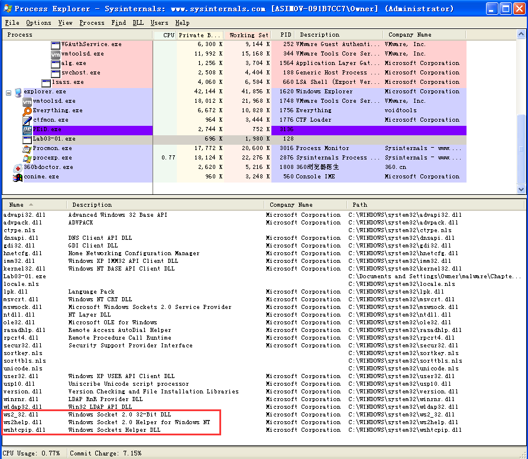

Process Monitor 重点关注下图中标出的 WriteFile（蓝色）和 RegSetValue（粉色）。


双击 WriteFile 一项，可以看到该操作向系统路径写入了一个文件 C:\WINDOWS\system32\vmx32to64.exe：


用 Everything 确实可以看到该文件：


双击 RegSetValue 一项，可以看到该操作往注册表写入了 HKLM\SOFTWARE\Microsoft\Windows\CurrentVersion\Run\VideoDriver 一项。（HKLM 也即 HKEY\_LOCAL\_MACHINE ）


用 regedit 打开注册表，定位到对应位置，确实能够看到该注册表项：

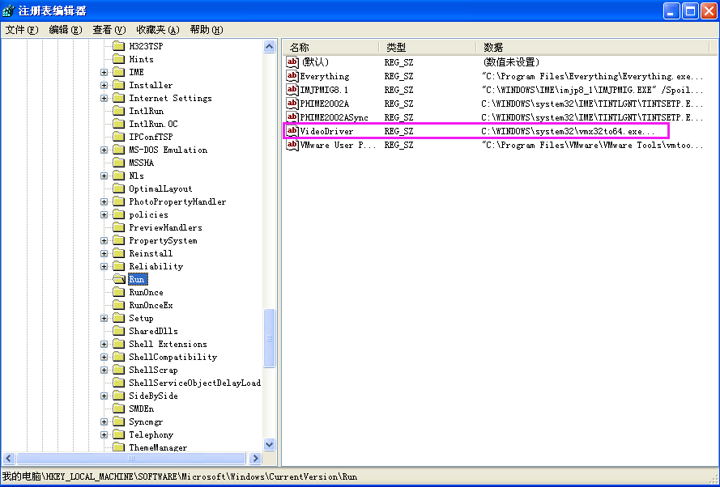

当然，该恶意程序还写入了一些“噪声”，也就是写入 HKLM\SOFTWARE\Microsoft\Cryptography\RNG\Seed 的注册表项。

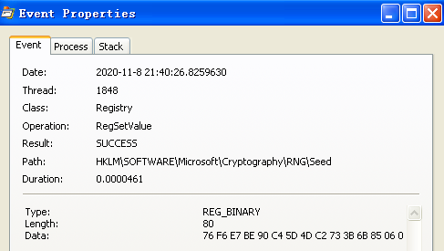

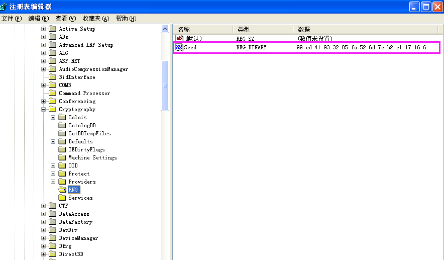

ApateDNS 监测到恶意代码向域名 www.practicalmalwareanalysis.com 发送了请求。并且该请求每隔 61 秒重新发送一次。


netcat 也在 443 端口监听到了一些数据。不过复现时（Kill Lab03-01.exe 再启动）却又看不到了。以后再说。


用 WireShark 没有监测到对应的包，看样子是我的使用姿势不对。以后再说。说是该恶意程序在解析域名时，会持续广播 256 字节的数据包，其中包含看似随机的二进制数据。

### **2、这个恶意代码在主机上的感染迹象特征是什么？**

答案：该恶意代码创建了一个名为 WinVMX32 的互斥量，并复制自身到 C:\Windows\System32\vmx32to64.exe，并安装自己到系统自启动项中，通过创建注册表键值 HKLM\SOFTWARE\Microsoft\Windows\CurrentVersion\Run\VideoDriver，并将其设置为复制副本的位置。

### **3、这个恶意代码是否存在一些有用的网络特征码？如果存在，它们是什么？**

答案：恶意代码在进行 www.practicalmalwareanalysis.com 的域名解析后，持续地广播大小为 256 字节的数据包，其中包含看似随机的二进制数据 。

**后续清理工作：恢复到之前的快照（最简单干净）**

* 在 Process Monitor 中终止 Lab03-01.exe
* 删除 vmx32to64.exe
* 删除 HKLM\SOFTWARE\Microsoft\Windows\CurrentVersion\Run\VideoDriver 注册表项

## Lab 3-2

使用动态分析基础技术来分析在Lab03-02.dll文件中发现 的恶意代码。

先来一波静态分析：

VirusTotal 报告，当然是报毒了：

*  [https://www.virustotal.com/gui/file/5eced7367ed63354b4ed5c556e2363514293f614c2c2eb187273381b2ef5f0f9/details](https://www.virustotal.com/gui/file/5eced7367ed63354b4ed5c556e2363514293f614c2c2eb187273381b2ef5f0f9/details)

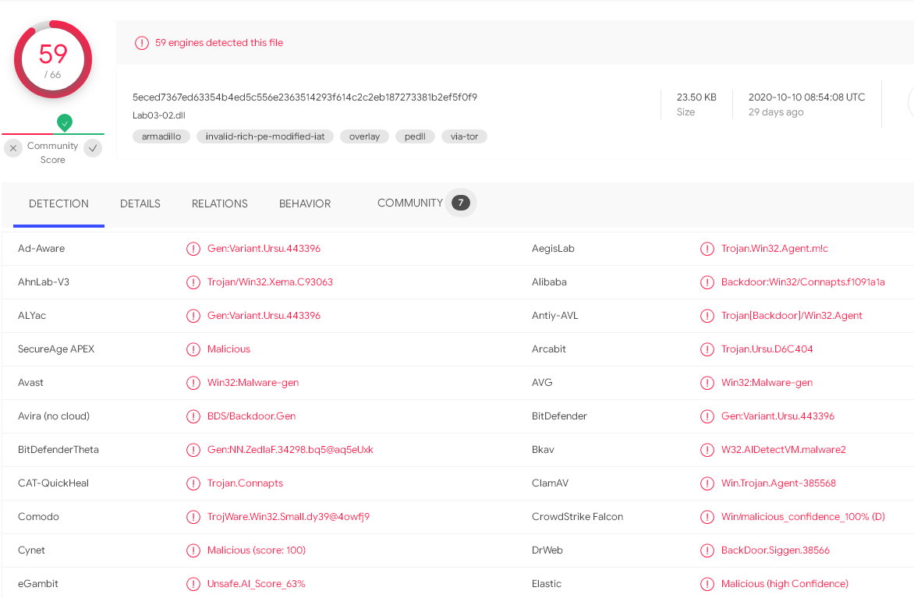

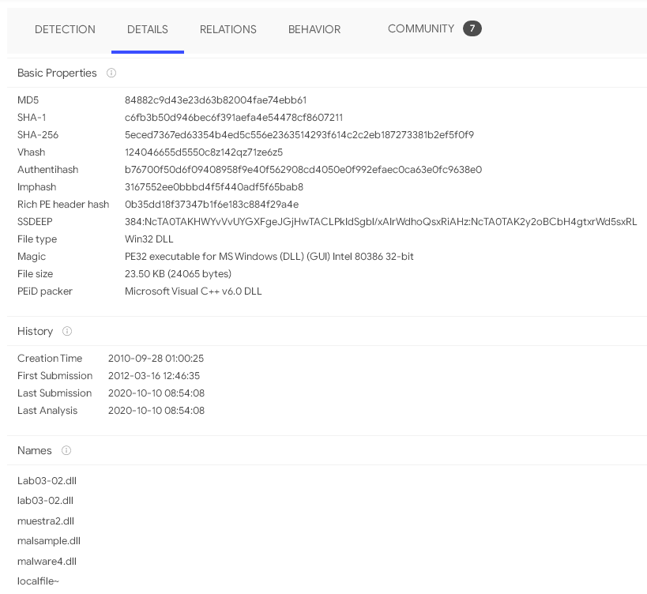

没有加壳，用的 VC 6.0：

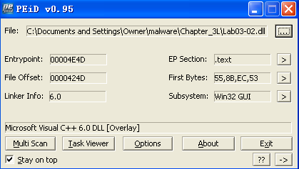

字符串解析，只列出独特的内容（文件名和域名）：

```text
practicalmalwareanalysis.com
%SystemRoot%\System32\svchost.exe -k
SYSTEM\CurrentControlSet\Services\
SOFTWARE\Microsoft\Windows NT\CurrentVersion\Svchost
```

然后准备好下列步骤，进行动态分析：

* **拍摄 VMWare 快照（重要！）**
* 打开 ApateDNS：DNS Reply IP 设置为 127.0.0.1
* **【可选】**打开 Process Monitor：：清除所有事件
* 打开 Process Explorer
* 打开 Netcat，监听 80 端口：**nc -l -p 80**

Dependency Walker 中的导出函数 ServiceMain 和 installA 表明，该恶意代码需要安装成服务才能正常运行：


使用 **rundll32.exe Lab03-02.dll,installA** 命令安装服务。

使用 **net start IPRIP** 启动服务：


在 Process Explorer 中查找 Lab03-02.dll，得知在进程 svchost.exe 中：

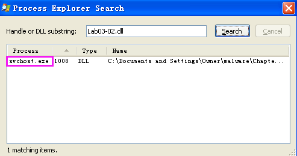

在 Process Explorer 中果然可以看到，View &gt; Lower Pane View &gt; DLLs，也可以找到 Lab03-02.dll 的身影。

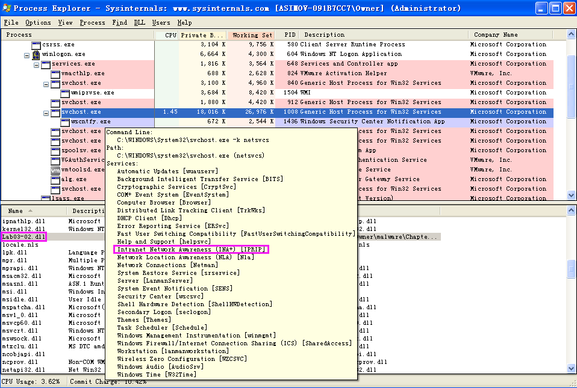

当然还可以在 Process Monitor 中挖掘出该服务的更多信息，可使用进程的 PID（1008）过滤，略。

ApateDNS 中显示该恶意服务请求过 practicalmalwareanalysis.com 域名：


netcat 的监听结果表明该服务会向远程主机请求 **/serve.html**，协议是 HTTP 1.1：


### **1、你怎样才能让这个恶意代码自行安装？**

```text
rundll32.exe Lab03-02.dll,installA
```

### **2、在安装之后，你如何让这个恶意代码运行起来？**

```text
net start IPRIP
```

### **3、你怎么能找到这个恶意代码是在哪个进程下运行的？**

答案：使用 Process Explorer 来确定哪个进程正在运行服务。由于恶意代码将会运行在一个系统上的 svchost.exe 进程中，因此查看每个进程， 直到看到该服务名，或者使用 Process Explorer 的 Find Dll 功能来搜索 Lab03-02.dll。

### **4、你可以在 procmon 工具中设置什么样的过滤器，才能收集这个恶意代码的信息？**

答案：在 procmon 工具 中，可以使用 在 Process Explorer 中发现的 PID 进行过滤 。

### **5、这个恶意代码在主机上的感染迹象特征是什么？**

答案：默认情况下，恶意代码将安装为 IPRIP 服务，显示的服务名称为 Intranet Network Awareness \(INA+\)，描述为 “Depends INA+, Collects and stores network configuration and location information, and notifies applications when this information changes”。

它将自身待久地安装在注册表中 HKLM\SYSTEM\CurrentControlSet\Services\IPRIP\Parameters\ServiceDll:%Currentdirectory%\Lab03-02.dll。

如果将 Lab03-02.dll 重命名为其他文件名，如 malware.dll，那么该恶意代码就会把 malware.dll 写入到注册表项中，而不是使用名称 Lab03-02.dll。

### **6、这个恶意代码是否存在一些有用的网络特征码？**

答案：恶意代码申请解析域名 practicalmalwareanalysis.com，然后通过 80 端口连接到这台主机，使用的 协议看起来似乎是 HTTP 协议。它在做一个 GET 请求 serve.html，使用的用户代理为 **%ComputerName% Windows XP 6.11** 。

## Lab 3-3

在一个安全的环境中执行 Lab03-03.exe 文件中发现的恶意代码，同时使用基础的动态行为分析工具监视它的行为。

**先静态分析一波。**

VirusTotal 报告，报毒，图略：

*  [https://www.virustotal.com/gui/file/ae8a1c7eb64c42ea2a04f97523ebf0844c27029eb040d910048b680f884b9dce/details](https://www.virustotal.com/gui/file/ae8a1c7eb64c42ea2a04f97523ebf0844c27029eb040d910048b680f884b9dce/details)

没有加壳，用的 VC 6.0：

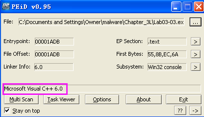

strings 解析不出来什么内容，大片的 A 字符：

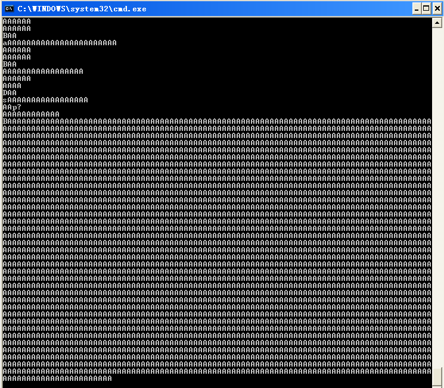

然后准备好下列步骤，进行动态分析：

* **拍摄 VMWare 快照（重要！）**
* 打开 Process Explorer
* 打开 Process Monitor：关闭捕捉（Ctrl+E），清除所有事件（Ctrl+X），开启捕捉（Ctrl+E）

运行 Lab03-03.exe。Process Explorer 中显示 Lab03-03.exe 创建了一个 svchost.exe 的进程，然后退出，保留 svchost.exe 作为孤儿进程运行（图中 PID 为 1732 的进程）。而正常情况下，svchost.exe 应当是 services.exe 的子进程。这一点很可疑。

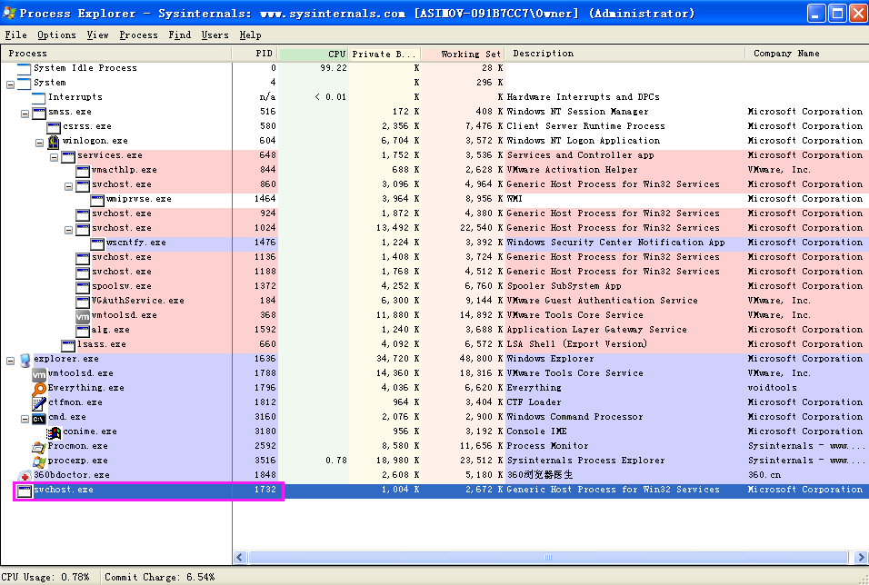

右键选择 Properties，对比磁盘和内存中的字符串，发现差异很大。内存中的字符串多出很多内容。注意到多出了 practicalmalwareanalysis.log 和 \[SHIFT\]、\[ENTER\]、\[BACKSPACE\] 这样的字符串，而这些通常在正常的 svchost.exe 的磁盘镜像中不应当出现。推测是一个击键的记录器。


在 Process Monitor 中过滤，添加 **PID is 1732** 规则。打开记事本，敲击几个字符。可以看到 Process Monitor 中的事件数立刻增加，主要是将 practicalmalwareanalysis.log 文件 WriteFile ****到 Lab03-03.exe 所在路径下。


打开 practicalmalwareanalysis.log，注意选择编码 Western \(Windows 1252\)，果然是击键的记录：

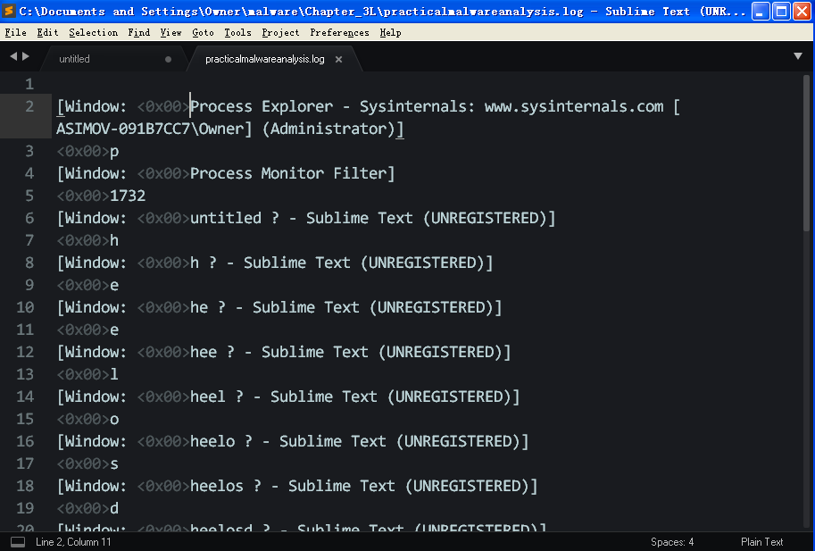

**事后清理：还原到此前 VM 快照。**

### **1、当你使用 Process Explorer 工具进行监视时，你注意到了什么？**

答案：恶意代码执行了对 svchost.exe 文件的替换 。

### **2、你可以找出任何的内存修改行为吗？**

答案：对比内存映像与磁盘映像中的 svchost. exe, 显示它们并不是 一 样的。内存映像拥有如 practicalmalwareanalysis.log 和 \[ENTER\] 这样的字符串，而磁盘镜像中却没有。

### **3、这个恶意代码在主机上的感染迹象特征是什么？**

答案：这个恶意代码创建了一个 practicalmalwareanalysis.log 日志文件。

### **4、这个恶意代码的目的是什么？**

答案：这个程序在 svchost.exe 进程上执行了进程替换，来启动一个击键记录器。

## Lab 3-4

使用基础的动态行为分析工具来分析在 Lab03-04.exe 文件中发现的恶意代码。

（这个程序还会在第 9 章 的实验作业中进一步分析）

**先静态分析一波。**

VirusTotal 报告，报毒，不过居然有不少引擎没有识别出来：[https://www.virustotal.com/gui/file/6ac06dfa543dca43327d55a61d0aaed25f3c90cce791e0555e3e306d47107859/details](https://www.virustotal.com/gui/file/6ac06dfa543dca43327d55a61d0aaed25f3c90cce791e0555e3e306d47107859/details)

未加壳，用的 VC 6.0。

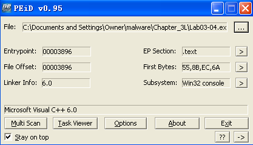

导入函数包含 kernel32.dll 中的 DeleteFile 和 shell32.dll 中的 ShellExecute，猜测可能调用系统命令进行文件删除操作。

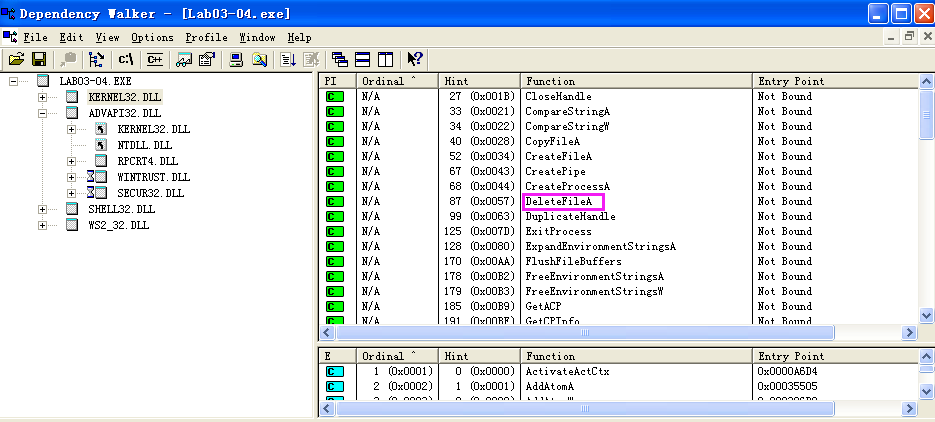

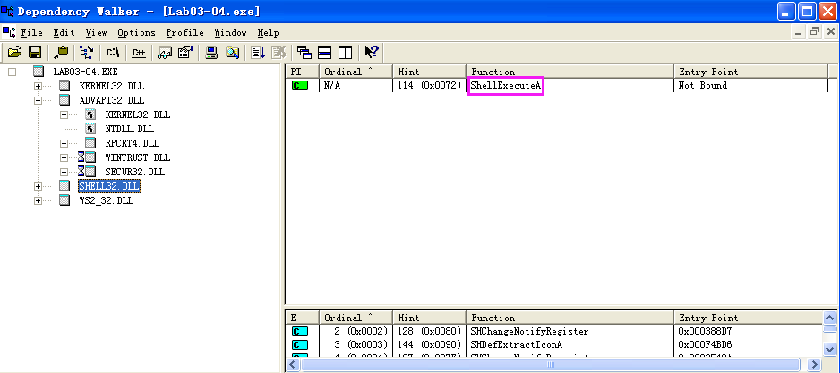

字符串解析，得到不少有用信息：

* 文件和环境的函数名：GetFileAttributes、GetEnvironmentStrings
* 系统命令：cmd.exe、/c del、CMD、SLEEP、DOWNLOAD、UPLOAD
* 疑似命令行参数：-cc、-re、-in、k:%s h:%s p:%s per:%s
* HTTP 命令：HTTP/1.0、GET
* 域名：http://www.practicalmalwareanalysis.com
* 系统文件：%SYSTEMROOT%\system32\


运行 Lab03-04.exe。可以看到几秒后该文件从文件夹中消失。

Process Monitor 添加过滤规则 Process Name is Lab03-04.exe。记录了很多与注册表和文件相关的操作（RegQueryValue、RegOpenKey、RegCloseKey、ReadFile、CreateFile、CloseFile）。暂时不必看懂。

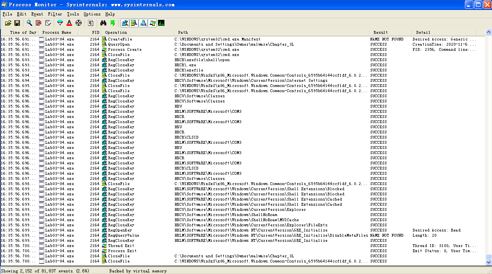

**后续清理：回滚到此前的 VM 快照。**

### **1、当你运行这个文件时，会发生什么呢？**

答案：双击运行该恶意代码时，它会立刻将自身删除掉 。

### **2、是什么原因造成动态分析无法有效实施？**

答案：有可能需要提供一个命令行参数，或者是这个程序缺失某个部件。

### **3、是否有其他方式来运行这个程序？**

答案：可以尝试使用在字符串列表中显示的一些命令行参数 ，比如 -in，但这样做没有得到有效结果，所以需要更深入的分析。 （我们将在第 9 章的实验作业中进一步分析这个恶意代码。）

## 参考链接

* 恶意代码分析实战笔记（二） \| damaoooo的blog 
  * [https://damaoooo.github.io/2019/12/08/实验四/\#恶意代码分析实战笔记（二）](https://damaoooo.github.io/2019/12/08/实验四/#恶意代码分析实战笔记（二）)


