# 第 5 章：IDA Pro

## Lab5-1

只用 IDA Pro 分析在文件 Lab05-01.dll 中发现的恶意代码。这个实验的目标是给你一个用 IDA Pro 动手的经验。如果你已经用 IDA Pro 工作过，你可以选择忽略这些问题，而将精力集中在逆向工程恶意代码上。

### **1、DllMain 的地址是什么？**

答案：.text:1000D02E。

### **2、使用 Imports 窗口并浏览到 gethostbyname，导入函数定位到什么地址？**

答案：.idata:100163CC。

### **3、有多少函数调用了 gethostbyname？**

答案：选择 Imports 视窗，找到 gethostbyname（注意：IDA Pro 中的函数名排序是区分大小写的，大写字母在前，小写字母在后，所以需要往后翻），双击跳转到定义位置。Ctrl + X 查看交叉引用。

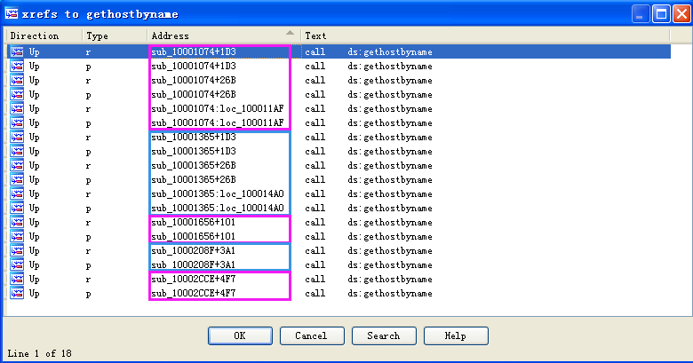

看上去有 18 行，实际上 IDA Pro 6.8 计算了两次交叉引用，一次是类型 p（被调用的引用），另一次是 r（被读取的引用）。所以是 9 次交叉引用。按照 Address 排序，仔细数一下，**一共被 5 个函数调用。**后面 + 号和 : 号都是偏移地址，都属于同一个函数。

### **4、将精力集中在位于 0x10001757 处的对 gethostbyname 的调用，你能找出哪个 DNS 请求将被触发吗？**

答案：按 G 输入跳转的地址 0x10001757，或者直接在上面的交叉引用的表格里选中sub\_10001656+101 一项，点击 OK：


跳转到对应的地址：

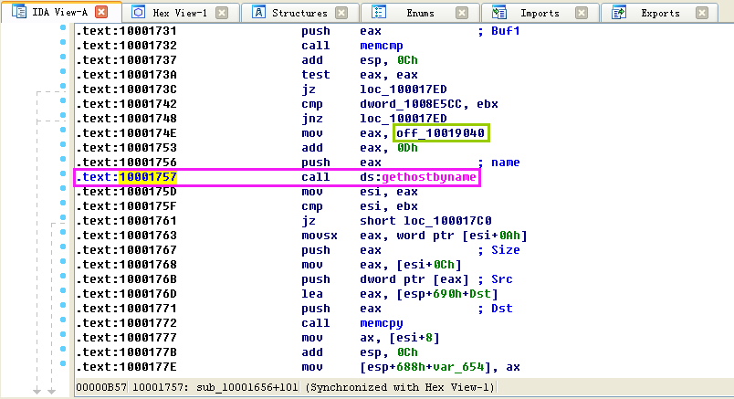

查看输入参数需要往上找 3 行，在 off\_10019040 处。双击偏移地址，可以发现该地址开始储存了字符串 “**\[This is RDO\]pics.practicalmalwareanalysis.com”。**把光标悬浮在这里就可以看到存储的内容，或者在右边的注释中也有：

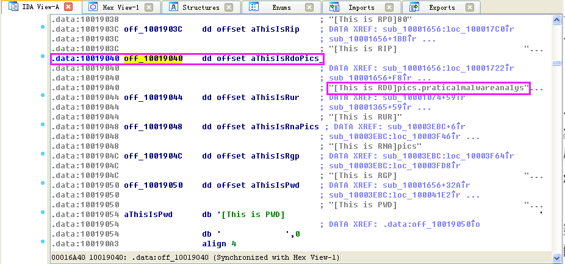

在上上图中，注意到 **mov eax,off\_10019040** 后面还有一句 **add eax,0Dh**，也即偏移 13 个字节，所以实际上请求的 DNS 为 **“pics.practicalmalwareanalysis.com”**：

```text
[This is RDO]pics.practicalmalwareanalysis.com
             ↑
0123456789ABCD
```

字符串在内存中是这样存储的：


### **5、IDA Pro 识别了在 0x10001656 处的子过程中的多少个局部变量？**

答案：按 G 跳转到 0x10001656。然后很有可能发现直接就是汇编（红框），这时需要往上翻（粉框），看到绿色的部分（紫框），也就是 IDA Pro 识别出来的局部变量。5 个一组，**细数一下是 23 个**（不包含最后一行的 lpThreadParameter，因为是传入的参数）。不同版本识别能力或许有差异，和这个数字可能会有些出入。


### **6、IDA Pro 识别了在 0x10001656 处的子过程中的多少个参数？**

答案：见上图橙色框出部分（两处），上面一处表明传入的参数为 **lpThreadParameter**，然后在下面一处也被识别出来了，也即 **dword ptr 4**。所以 IDA Pro 识别了子过程中的 **1 个参数**。

### **7、使用 Strings 窗口，来在反汇编中定位字符串 \cmd.exe /c。它位于哪？**

答案：通过 View &gt; Open Subviews &gt; Strings，或者 Shift + F12 打开 Strings 窗口。Ctrl + F 搜索 cmd。

在地址 **xdoors\_d:10095B34** 处可以找到 **\\cmd.exe /c**。

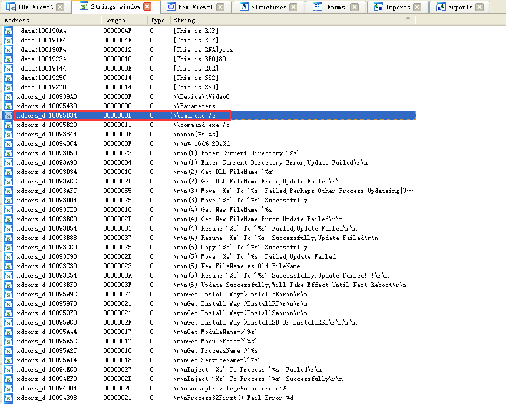

双击查看汇编代码，按下 Ctrl + X 查看交叉引用，有且仅有 sub\_1000FF58+278 一处：

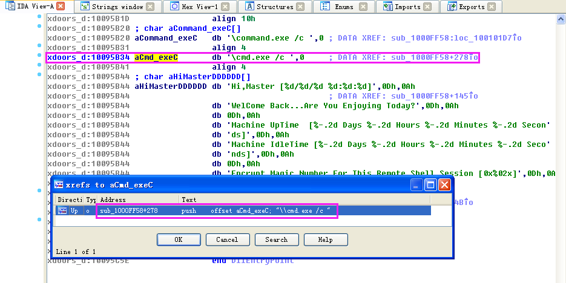

### **8、在引用 \cmd.exe /c 的代码所在的区域发生了什么？**

答案：将上图中的重要信息框出：


在上图中，点击 OK，跳到 cmd.exe 被交叉引用的地方，也即 .text:100101D0 处，该命令被压栈。在命令的后面还能看到用 memcmp 比较 recv、quit、exit、cd、uptime 等指令字符串。在青框中的注释里，也出现了字符串 “This Remote Shell Session”。**因此猜测这是一个远程 Shell 会话函数。**

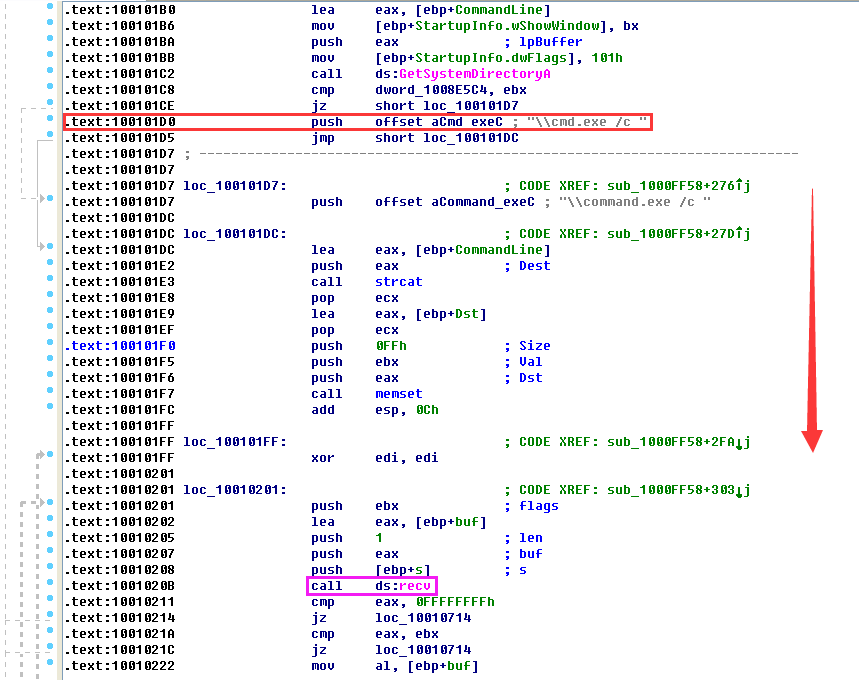


右键选择 Graph View，可以看到图形化的表示。

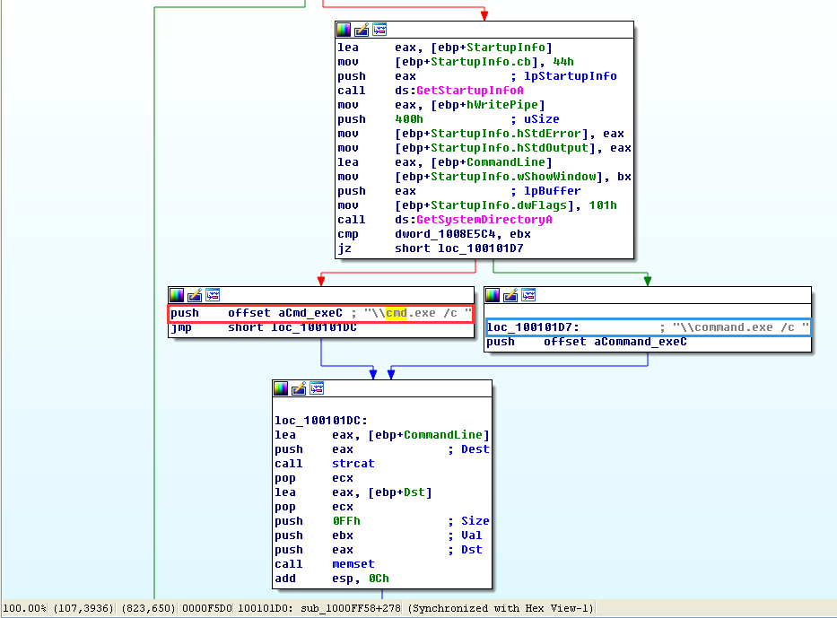

### **9、在同样的区域，在 0x100101C8 处，看起来好像 dword\_1008E5C4 是一个全局变量，它帮助决定走哪条路径。那恶意代码是如何设置 dword\_1008E5C4 的呢？（提示：使用 dword\_1008E5C4 的交叉引用。）**

答案：跳到 100101c8，**cmp dword\_1008E5C4,ebx**，也即将 ebx 同该全局变量比较。


双击跳到定义位置（.data:1008E5C4），Ctrl + X 查看交叉引用，只有 sub\_10001656+22 处的 **mov dword\_1008E5C4,eax** 语句修改了该值。选中，点击 OK 跳到对应位置。

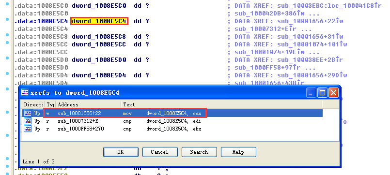

其中 eax （蓝框）是上一行调用的函数 sub\_10003695 （粉框）的返回值，双击进入该函数：


可以看到该函数调用了 GetVersionEx，也即获取当前操作系统的信息，**xor eax,eax** 语句将 eax 置 0，并且，**cmp \[ebp+VersionInformation.dwPlatformId\],2** 语句将平台类型同 2 相比。

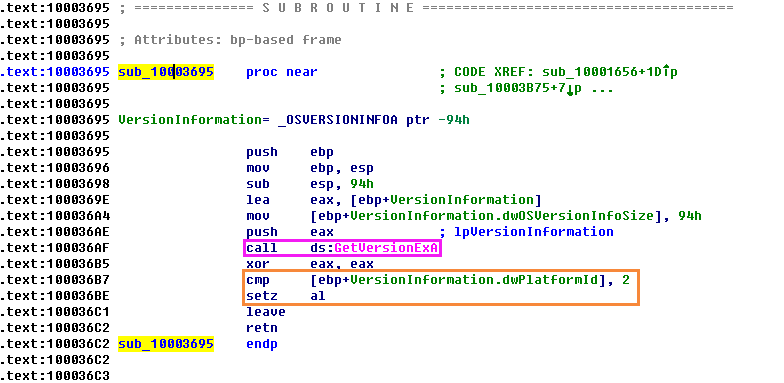

根据微软的文档，我们得知通常情况下 dwPlatformId 的值为 2：

`dwPlatformId`: The operating system platform. This member can be the following value.

| Value | Meaning |
| :--- | :--- |
| **VER\_PLATFORM\_WIN32\_NT** 2 | The operating system is Windows 7, Windows Server 2008, Windows Vista, Windows Server 2003, Windows XP, or Windows 2000. |

* OSVERSIONINFOA \(winnt.h\) - Win32 apps \| Microsoft Docs 
  * [https://docs.microsoft.com/en-us/windows/win32/api/winnt/ns-winnt-osversioninfoa](https://docs.microsoft.com/en-us/windows/win32/api/winnt/ns-winnt-osversioninfoa)

所以通常情况下，cmp 操作中，src==dst，则标志寄存器 ZF=1、CF=0，**setz al** 的含义是如果 ZF=1 则置 al 为 1。因此 al 的结果为 1。由于 al 是 eax 的最低 8 位，且 eax 此前已经通过异或操作置 0，故此时 eax 的值为 1。故 sub\_10003695 执行完后，eax 为 1，紧接着执行 **mov dword\_1008E5C4,eax**，故 dword\_1008E5C4 的值为 1。

### **10、在位于 0x1000FF58 处的子过程中的几百行指令中，一系列使用 memcmp 来比较字符串的比较。如果对 robotwork 的字符串比较是成功的（当 memcmp 返回 0），会发生什么？**

答案：跳转到 1000FF58 处的子过程，往上翻一点查看 subroutine 识别出来的变量与参数。


往下翻很多，可以到不少 memcp 语句，好多在前面的问题分析中都出现过：

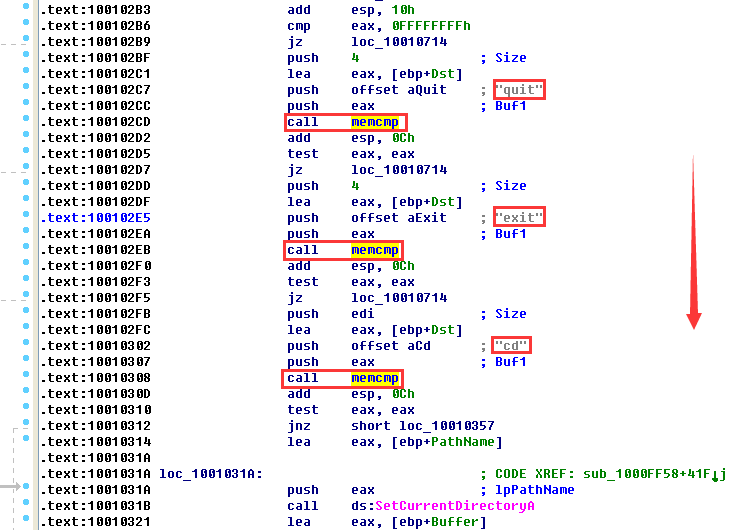

终于在 1001044C 处找到了 robotworks（红框）。往下两行可以看到 **call memcmp**（粉框）。如果 eax 和 robotwork 相同，则 memcmp的结果为 0，也即 eax 为 0。

test 的作用 和 and 类似，只是不修改寄存器操作数，只修改标志寄存器，因此 **test eax,eax** （紫框）的含义是，若 eax 为 0，那么 test 的结果为 ZF=1。结合 **jnz short loc\_10010468** 语句，若 ZF=1，则不会跳转，继续向下执行，直到 **call sub\_100052A2**。

这里顺便解释一下 10010457 处的 **add esp,0Ch** 语句。0Ch=12d，由于上面三次 push（9、offset aRobotWork、eax）均为 2 个字，也即 4 字节，那么这三次总计 12 字节，将 esp 增加 12 字节，也就是把栈指针向“底部”移动 12 字节，等价于将此前那三次 push 的内容“回收”或者“丢弃”了。


双击查看 sub\_100052A2 的代码。其参数为 socket 类型。也就是上图中 1001045E 处 push 进去的 \[ebp+s\]。其他可以忽略，往下一直翻到 100052E7 处的 aSoftWareMicros（红框），其值为 “SOFTWARE\Microsoft\Windows\CurrentVersion”。最后调用 RegOpenKeyEx 函数（蓝框），读取该注册表值。

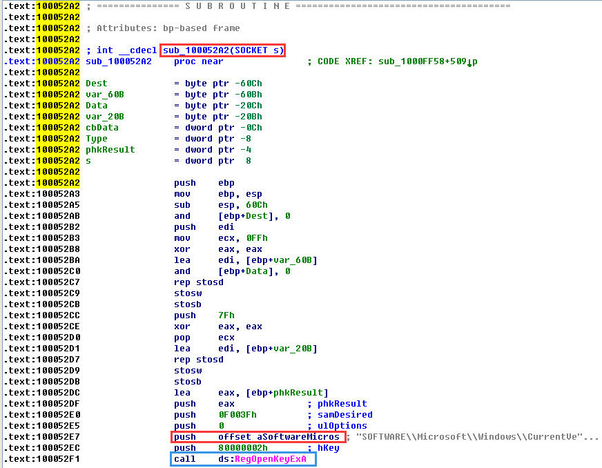


在 CurrentVersion 的键值下，跳到 loc\_10005309（红框），取得 WorkTime 的键值（粉色+蓝色）。

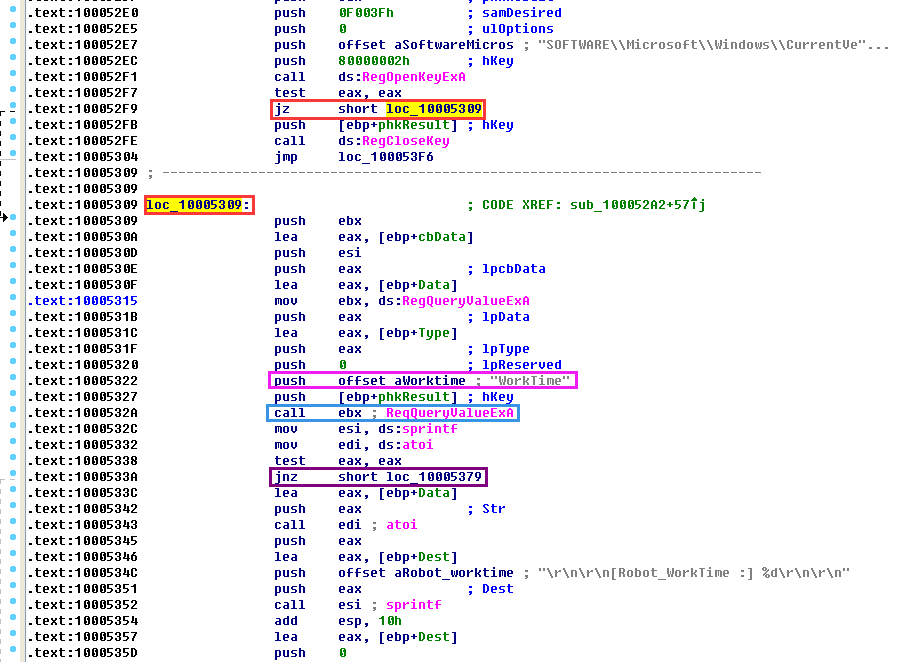

再跳到 loc\_10005379（紫框），取得 WorkTimes 的键值（粉色+蓝色）。

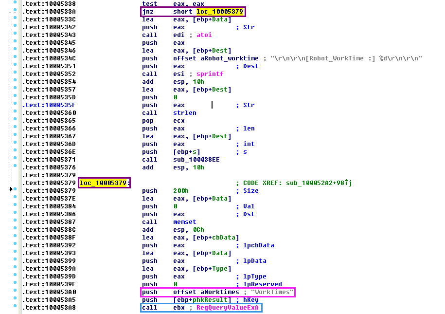

按书中所述，这些信息最终传给了此前 push 进去的 \[ebp+s\] 也即 socket s 处。

### **11、PSLIST 导出函数做了什么？**

答案：在 Exports 窗口找到 PSLIST，双击点开。首先调用 sub\_100036C（红色）。

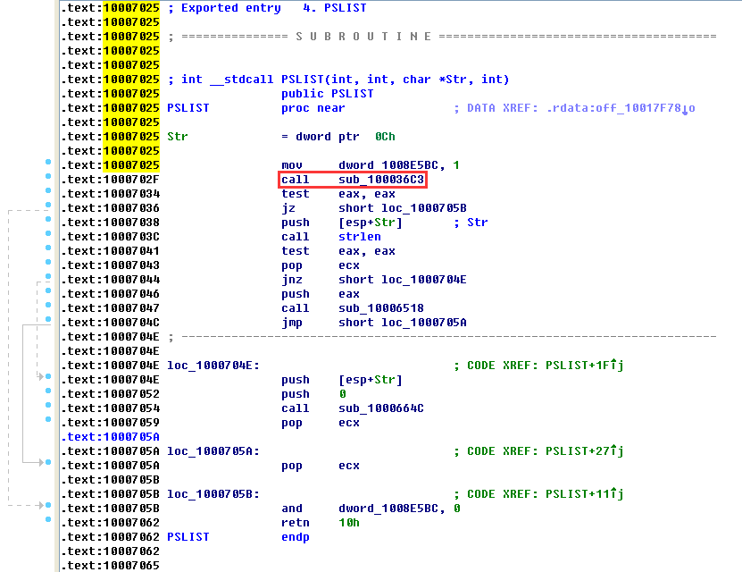

双击点开如下图。若 dwPlatformId 不为 2（粉色），或 dwMajorVersion 小于 5（蓝色），则 eax 为 0（绿色），否则 eax 为 0（橙色）。

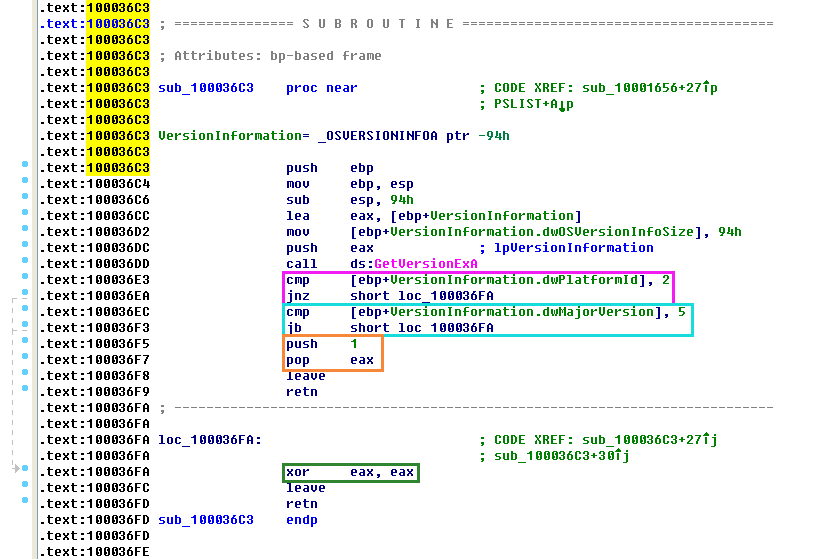

在第 9 问中已经讨论过，绝大多数系统的 dwPlatformId 都为 2。对于 dwMajorVersion，不同系统的值如下表所示。可见绝大多数系统的值也都是大于等于 5。

| Operating system | Version number | **dwMajorVersion** | **dwMinorVersion** | Other |
| :--- | :---: | :---: | :---: | :--- |
| Windows 10 | 10.0\* | 10 | 0 | OSVERSIONINFOEX.wProductType == VER\_NT\_WORKSTATION |
| Windows Server 2016 | 10.0\* | 10 | 0 | OSVERSIONINFOEX.wProductType != VER\_NT\_WORKSTATION |
| Windows 8.1 | 6.3\* | 6 | 3 | OSVERSIONINFOEX.wProductType == VER\_NT\_WORKSTATION |
| Windows Server 2012 R2 | 6.3\* | 6 | 3 | OSVERSIONINFOEX.wProductType != VER\_NT\_WORKSTATION |
| Windows 8 | 6.2 | 6 | 2 | OSVERSIONINFOEX.wProductType == VER\_NT\_WORKSTATION |
| Windows Server 2012 | 6.2 | 6 | 2 | OSVERSIONINFOEX.wProductType != VER\_NT\_WORKSTATION |
| Windows 7 | 6.1 | 6 | 1 | OSVERSIONINFOEX.wProductType == VER\_NT\_WORKSTATION |
| Windows Server 2008 R2 | 6.1 | 6 | 1 | OSVERSIONINFOEX.wProductType != VER\_NT\_WORKSTATION |
| Windows Server 2008 | 6.0 | 6 | 0 | OSVERSIONINFOEX.wProductType != VER\_NT\_WORKSTATION |
| Windows Vista | 6.0 | 6 | 0 | OSVERSIONINFOEX.wProductType == VER\_NT\_WORKSTATION |
| Windows Server 2003 R2 | 5.2 | 5 | 2 | GetSystemMetrics\(SM\_SERVERR2\) != 0 |
| Windows Home Server | 5.2 | 5 | 2 | OSVERSIONINFOEX.wSuiteMask & VER\_SUITE\_WH\_SERVER |
| Windows Server 2003 | 5.2 | 5 | 2 | GetSystemMetrics\(SM\_SERVERR2\) == 0 |
| Windows XP Professional x64 Edition | 5.2 | 5 | 2 | \(OSVERSIONINFOEX.wProductType == VER\_NT\_WORKSTATION\) && \(SYSTEM\_INFO.wProcessorArchitecture==PROCESSOR\_ARCHITECTURE\_AMD64\) |
| Windows XP | 5.1 | 5 | 1 | Not applicable |
| Windows 2000 | 5.0 | 5 | 0 | Not applicable |

* OSVERSIONINFOEXA \(winnt.h\) - Win32 apps \| Microsoft Docs 
  * [https://docs.microsoft.com/en-us/windows/win32/api/winnt/ns-winnt-osversioninfoexa](https://docs.microsoft.com/en-us/windows/win32/api/winnt/ns-winnt-osversioninfoexa)

总之，对于绝大数系统，这两个判断得到的结果，都应当得到 eax 为 1。

为了参考方便，再次放上 PLIST 的图。上面讨论过，eax 通常应为 1，因此一般情况下不进行下图红色部分的跳转（跳转是直接结束），而是继续向下执行。先 push 一个字符串 Str，然后求出其长度（蓝色），存入 eax。若该字符串非空，那么 eax 非 0，也即 test eax,eax 得到 ZF=0，那么将会进行 **jnz short loc\_1000704E** （紫色）的跳转。空字符串的情况我们就略掉。

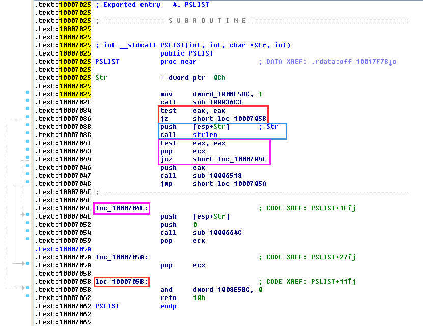

跳转后会执行 sub\_1000664C（橙色）。


双击点开，并且往下翻，可以看到调用了 CreateToolHelp32Snapshot：

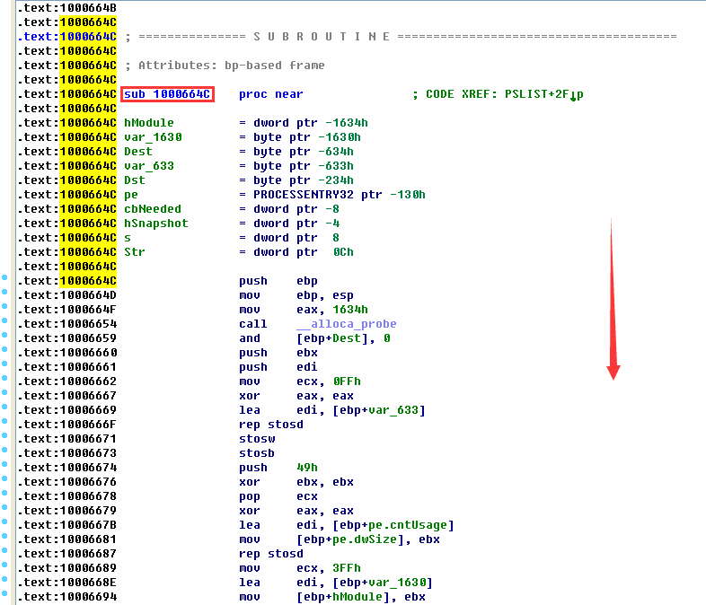

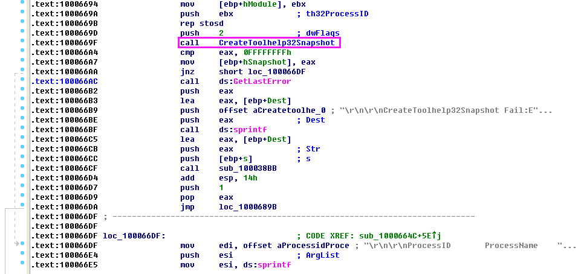

CreateToolhelp32Snapshot 的作用是，为指定的进程，及其使用的堆、模块和线程，拍摄快照：

> Takes a snapshot of the specified processes, as well as the heaps, modules, and threads used by these processes.

* CreateToolhelp32Snapshot function \(tlhelp32.h\) - Win32 apps \| Microsoft Docs 
  * [https://docs.microsoft.com/en-us/windows/win32/api/tlhelp32/nf-tlhelp32-createtoolhelp32snapshot](https://docs.microsoft.com/en-us/windows/win32/api/tlhelp32/nf-tlhelp32-createtoolhelp32snapshot)

执行完 sub\_1000664C 之后，pop ecx，再 retn、endp，PSLIST 返回。

**综上，PSLIST 的作用应该是获得一个进程的列表。又依据书中所述，获得的进程列表将通过 socket  的 send 发送。**

### 12、使用图模式来绘制出对 sub\_10004E79 的交叉引用图。当进入这个函数时，哪个 API 函数可能被调用？仅仅基于这些 API 函数，你会如何重命名这个函数？

答案：View &gt; Graphs &gt; User xrefs chart ...，起始和终止地址均设置为 .text:10004E9C，得到交叉引用图（或者 G 到地址 10004E9C，然后右键 Xrefs graph **from**）。主要调用的 API 为 GetSystemDefaultLangID 和 send。因此推测可能是将系统的默认语言标识发送出去。可以重命名为 **send\_lang\_id**。直接在函数名处右键 Rename 即可。

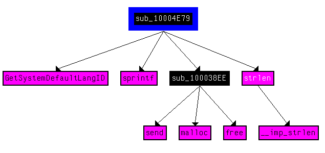

### 13、DllMain 直接调用了多少个 Windows API？多少个在深度为 2 时被调用？

答案：按 G 跳到 Dllmain 的起始位置 1000D02E（或者 View &gt; Open SubViews &gt; Functions，然后找到 DllMain\(x,x,x\)，然后双击），接着右键 Xrefs graph from ...，可以看到图中一团黑。

所以还是应当使用 View &gt; Graphs &gt; User xrefs chart ... 选项弹出对话框，曲线勾选 Cross references to，并且将 Recursion depth 从 -1 改为 1。可以看到调用的 Windows API （粉色）为 CreateThead、strncpy、strlen 以及 \_strnicmp。


### 14、在 0x10001358 处，有一个对 Sleep（一个使用一个包含要睡眠的毫秒数的参数的 API 函数）的调用。顺着代码向后看，如果这段代码执行，这个程序会睡眠多久？

答案：调用的 sleep（红色）的参数为上一行 push 的 eax，eax 的值又来自乘法 **imul eax,3E8h** 的运算结果（蓝色）。3E8h 的十进制为 1000，也可以通过右键该数字查看。再往上，eax 是由 atoi 函数（粉色）对 Str 运算得到的，也即字符串转整数。


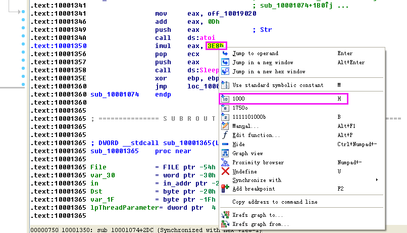

再往上，该 Str 由 off\_10019020+0Dh 位置的字符串得到（橙色），也即 “30”，最终转换成数字 30。

```text
[This is CTI]30
             ↑
0123456789ABCD
```

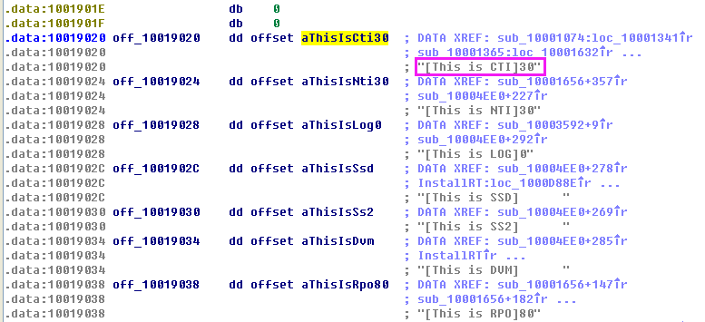

所以睡眠的时间应为 30\*1000 = 30000（毫秒），也即 30 秒。Sleep 函数的官方文档如下：

```cpp
// Parameters: dwMilliseconds
//   The time interval for which execution is to be suspended, in milliseconds.

void Sleep(
  DWORD dwMilliseconds
);
```

* Sleep function \(synchapi.h\) - Win32 apps \| Microsoft Docs 
  * [https://docs.microsoft.com/en-us/windows/win32/api/synchapi/nf-synchapi-sleep](https://docs.microsoft.com/en-us/windows/win32/api/synchapi/nf-synchapi-sleep)

### 15、在 0x10001701 处是一个对 socket 的调用。它的 3 个参数是什么？

答案：IDA 中显示的三个参数名：af、type、protocol。

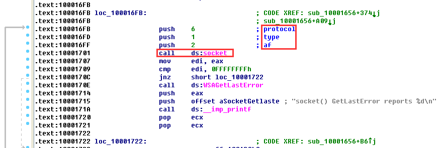

### 16、使用 MSDN 页面的 socket 和 IDA Pro 中的命名符号常量，你能使参数更加有意义吗？在你应用了修改以后，参数是什么？

socket 的官方文档如下：

```cpp
// The socket function creates a socket 
//   that is bound to a specific transport service provider.

SOCKET WSAAPI socket(
  int af,
  int type,
  int protocol
);
```

* socket function \(winsock2.h\) - Win32 apps \| Microsoft Docs 
  * [https://docs.microsoft.com/en-us/windows/win32/api/winsock2/nf-winsock2-socket](https://docs.microsoft.com/en-us/windows/win32/api/winsock2/nf-winsock2-socket)

查看文档，af（2）、type（1）、protocol（6）中的数字分别对应：

| 参数名 | 输入数字 | 常量名 | 说明 |
| :--- | :--- | :--- | :--- |
| af | 2 | AF\_INET | 使用 IPv4 |
| type | 1 | SOCK\_STREAM | TCP 连接 |
| protocal | 6 | IPPROTO\_TCP | TCP 协议 |

**因此输入的参数含义为建立基于 IPv4 的 TCP 连接的 socket，通常在 HTTP 中使用。**

在数字上右键，Use standard symbolic constant，分别替换成实际的常量名，如图：


### 17、搜索 in 指令（opcode 0xED\) 的使用。这个指令和一个魔术字符串 VMXh 用来进行 VMware 检测。这在这个恶意代码中被使用了吗？使用对执行 in 指令函数的交叉引用，能发现进一步检测 VMware 的证据吗？

答案：Search &gt; Text（Alt+T），输入 in；或者 Search Sequence of Bytes（Alt+B），输入 ED。然后选择 Find All Occurences。搜素结果中只有在地址 100061DB 处的一条 in eax,dx 的指令符合要求。


双击跳转到对应位置，可以看到 eax 中储存了字符串 “VMXh”，也就确认了这段代码采用了反虚拟机技巧：


往上翻到所在函数的入口处，也即 sub\_10006196（粉色），按下 Ctrl+X 打开交叉引用，选择第一个，点击 OK。

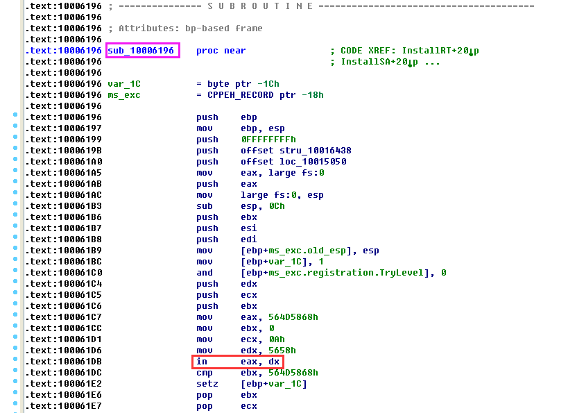

可以看到该函数的后文中也出现了字符串 “Found Virtual Machine,Install Cancel.” 的字眼，印证了我们的猜测。


### 18、将你的光标跳转到 0x1001D988 处，你发现了什么？

答案：发现了一段看似随机的数据。据书中所述，需要运行一段 Python 脚本。

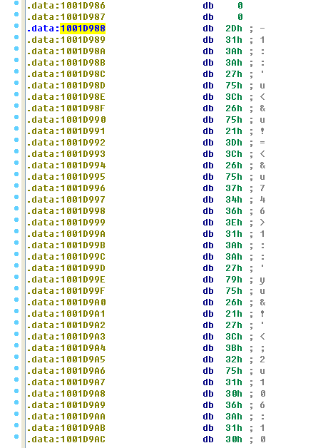

### 19、如果你安装了 IDA Python 插件（包括 IDA Pro 的商业版本的插件），运行 Lab05-01.py，一个本书中随恶意代码提供的 IDA Pro Python 脚本，（确定光标是在 0x1001D988 处。）在你运行这个脚本后发生了什么？

该 Python 脚本内容如下：



```cpp
sea = ScreenEA()

for i in range(0x00,0x50):
        b = Byte(sea+i)
        decoded_byte = b ^ 0x55
        PatchByte(sea+i,decoded_byte)
```



**一定确保光标恰好停在 0x1001D988 处（如果不是，就关闭文件再打开一次，否则转换始终是不对的）**，然后点击 File &gt; Script file（Alt+F7），选择 Lab05-01.py。会自动运行，然后可以看到这部分的数据发生了变化。注释的 ASCII 字符由原来的乱码变成了有意义的内容。图太长，略。

### 20、将光标放在同一位置，你如何将这个数据转成一个单一的 ASCII 字符串？

答案：在地址 0x1001D988 处，右键选择转换成 ASCII 字符串（或者按下 A 键），得到字符串 'xdoor is this backdoor, string decoded for Practical Malware Analysis Lab :\)1234'：


### 21．使用一个文本编辑器打开这个脚本。它是如何工作的？

答案：再次粘贴 Lab05-01.py 的源代码如下。其作用就是从光标选中位置开始，共 0x50 个字节，将每个字节同 0x55 作异或运算（相当于解码），再写入 IDA 的数据库中（所以我们能够立刻看到修改结果）。



```cpp
sea = ScreenEA()

for i in range(0x00,0x50):
        b = Byte(sea+i)
        decoded_byte = b ^ 0x55
        PatchByte(sea+i,decoded_byte)
```



## 参考链接

* 恶意代码分析实战 Lab 5-1 习题笔记\_isinstance的博客-CSDN博客 
  * [https://blog.csdn.net/isinstance/article/details/77867855](https://blog.csdn.net/isinstance/article/details/77867855)
* \[原创\]《恶意代码分析实战》第五章IDA Pro（Lab5-1分析报告）-软件逆向-看雪论坛-安全社区\|安全招聘\|bbs.pediy.com 
  * [https://bbs.pediy.com/thread-263319.htm](https://bbs.pediy.com/thread-263319.htm)
* 恶意代码分析实战 — Lab 05-01 – Atom Kid 
  * [http://www.atomsec.org/安全/2638/](http://www.atomsec.org/安全/2638/)

